# At-Scale Infrastructure Deployment Using CodePipeline and Stacker

In this challenge, you will create a [Continuous Integration/Continuous Deployment](https://www.atlassian.com/continuous-delivery/principles/continuous-integration-vs-delivery-vs-deployment) pipeline using AWS' CodePipeline and a couple of [OSS](https://en.wikipedia.org/wiki/Open-source_software) to validate CloudFormation templates against the CloudFormation specification and to make sure InfoSec best practices are being followed by your template.

# Table of Contents

- [Tools and Techs](#tools-and-techs)
- [How Is This Challenge Structured](#how-is-this-challenge-structured)
- [Architecture](#architecture)
- [Getting Started](#getting-started)
  * [IMPORTANT INFORMATION BEFORE YOU START](#important-information-before-you-start)
  * [Accessing the AWS Console](#accessing-the-aws-console)
  * [Accessing your Cloud9 Environment](#accessing-your-cloud9-environment)
  * [Cloning the Pipeline Templates Repository](#cloning-the-pipeline-templates-repository)
- [Building the Solution](#building-the-solution)
  * [S3 Bucket for CodePipeline Artifacts (Step 1)](#s3-bucket-for-codepipeline-artifacts-step-1)
    + [For Discussion](#for-discussion)
    + [Definition of Done](#definition-of-done)
  * [Your first Build Stage: Linting (Step 2)](#your-first-build-stage-linting-step-2)
    + [For Discussion](#for-discussion-1)
    + [Definition of Done](#definition-of-done-1)
  * [The Security Build Stage (Step 3)](#the-security-build-stage-step-3)
    + [Definition of Done](#definition-of-done-2)
  * [Deploy a CodePipeline Pipeline (Step 4)](#deploy-a-codepipeline-pipeline-step-4)
    + [For Discussion](#for-discussion-2)
    + [Definition of Done](#definition-of-done-3)
  * [Uploading an artifact to S3 to trigger the pipeline (Step 5)](#uploading-an-artifact-to-s3-to-trigger-the-pipeline-step-5)
    + [Definition of Done](#definition-of-done-4)
  * [CFN-Lint (Step 6)](#cfn-lint-step-6)
    + [Definition of Done](#definition-of-done-5)
  * [CFN-Nag (Step 7)](#cfn-nag-step-7)
    + [Definition of Done](#definition-of-done-6)
  * [Fixing the issues found by CFN-Lint (Step 8)](#fixing-the-issues-found-by-cfn-lint-step-8)
    + [Definition of Done](#definition-of-done-7)
  * [Creating your own CFN-Nag rule (Step 9)](#creating-your-own-cfn-nag-rule-step-9)
    + [Folder structure](#folder-structure)
    + [Gemfile](#gemfile)
    + [Gemspec](#gemspec)
    + [cfn_nag_custom](#cfn-nag-custom)
    + [Tenancy Checker Rule](#tenancy-checker-rule)
    + [Definition of Done](#definition-of-done-8)
  * [Adding custom rules to the pipeline (Step 10)](#adding-custom-rules-to-the-pipeline-step-10)
    + [Definition of Done](#definition-of-done-9)
  * [Deploying CloudFormation Templates with Stacker (Step 11)](#deploying-cloudformation-templates-with-stacker-step-11)
    + [stacker-config.yaml](#stacker-configyaml)
    + [stacker_profiles](#stacker-profiles)
    + [Creating a CodeBuild Project for deploying CloudFormation stacks](#creating-a-codebuild-project-for-deploying-cloudformation-stacks)
    + [Definition of Done](#definition-of-done-10)
  * [BONUS: Generating CloudFormation Templates Dynamically using Stacker Blueprints (Step 12)](#bonus-generating-cloudformation-templates-dynamically-using-stacker-blueprints-step-12)
    + [Dynamically calculating subnet addresses](#dynamically-calculating-subnet-addresses)
    + [Creating your first Blueprint](#creating-your-first-blueprint)
    + [Making modifications to stacker-config.yaml](#making-modifications-to-stacker-configyaml)
    + [Installing the custom_blueprints package](#installing-the-custom-blueprints-package)
    + [Definition of Done](#definition-of-done-11)
- [Conclusion](#conclusion)

# Tools and Techs

Here's a list of tools and techs you will learn in this Dojo:

* [AWS CodePipeline](https://aws.amazon.com/codepipeline/)
* [AWS CodeBuild](https://aws.amazon.com/codebuild/)
* [cfn_lint](https://github.com/aws-cloudformation/cfn-python-lint)
* [cfn_nag](https://github.com/stelligent/cfn_nag)
* [Stacker](https://github.com/cloudtools/stacker)

# How Is This Challenge Structured

The challenge will start with an overview of the **solution's architecture**, followed by a **getting started** section to help you get access to the templates repo and the AWS Console. Then, there will be a number of sections where you will **develop a solution for a small piece of the puzzle**. And to make sure you've figured out each small piece correctly, there will be **Definition of Done** sections to show you how to test your solution. Finally, you will see some **For Discussion** sections (which are optional and can be skipped) - the goal of these sections is to create a discussion between the team members and the organizers about a certain topic.

# Architecture

This is the architecture of the final solution:

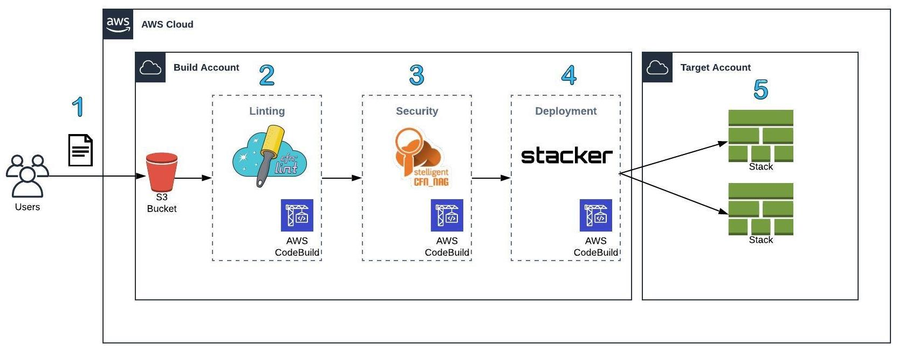

1. A user uploads a zip file containing CloudFormation templates and configuration files
1. The pipeline is triggered and executes the linting build stage first. During this stage, the CloudFormation templates from the zip file will be checked against the CloudFormation spec by **cfn_lint**
1. In the Security build stage, **cfn_nag** will make sure the templates are following security best practices
1. In the last build stage, **stacker** will deploy CloudFormation stacks to the target account
1. Finally, the CloudFormation stacks will deploy the resources specified in the templates to the Target account

# Getting Started

In this section, we'll go through a few steps to make sure you have access to the AWS Console and the code which you will be working on.

## IMPORTANT INFORMATION BEFORE YOU START

**Please read:**

* All resources you launch should have their names prefixed with **teamX-** (e.g. team1-xxxx, team2-xxxx, team3-xxxx - the dash should be included) otherwise you will not be able to launch them
* You will only be allowed to launch resources in the **N. Virginia (`us-east-1`)** region
* The AWS accounts used in this event will be monitored and any team that attempts to conduct any sort of malicious activity or launch forbidden resources which are not specified in this challenge will have their access to AWS revoked.
* Restrictions apart, have fun! :) 

## Accessing the AWS Console

To access the AWS Console, head over to the [AWS Sign-In page](https://devops-dojo.signin.aws.amazon.com/console). Your **IAM user name** will be teamX, where X is the number of your team (e.g. team1, team2, team3 etc). The password will be provided to you by one of the organizers. Once you log in, **make sure you are in the N. Virginia region**, otherwise you will get access denied for any service you try to use.

## Accessing your Cloud9 Environment

> *The steps below should be followed by EVERYONE in the team*

We've set up a [Cloud9 environment](https://aws.amazon.com/cloud9/) for your team. If you haven't heard of Cloud9 yet, it's an AWS solution for teams to write and debug code together just with a web browser (it's basically an IDE which you can access through the AWS Console, everyone sees in real time all the code changes being made and you also have access to a terminal).
After you've logged in to AWS, click on **Services** at the top and type in `Cloud9`. That will take you to the Cloud9 console. You should see your team's environment (team1 has been used as example only):


Click on **Open IDE**. This is what you should see:

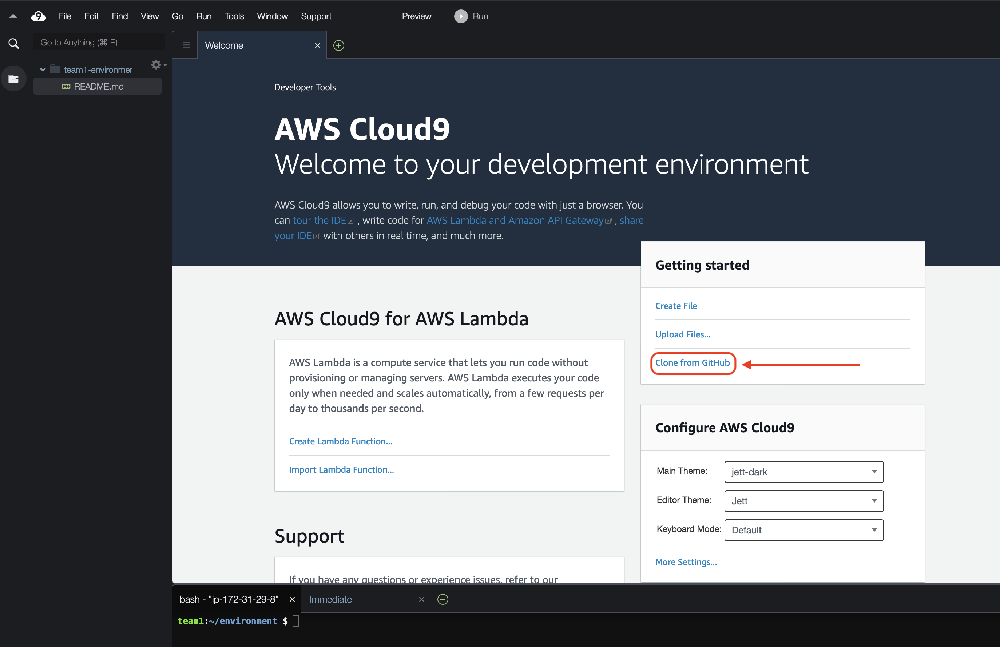

## Cloning the Pipeline Templates Repository

When you open the Cloud9 IDE, there will be a link to **Clone from GitHub**. Click on it. A terminal will open with a `git clone` command ready to be fired: 

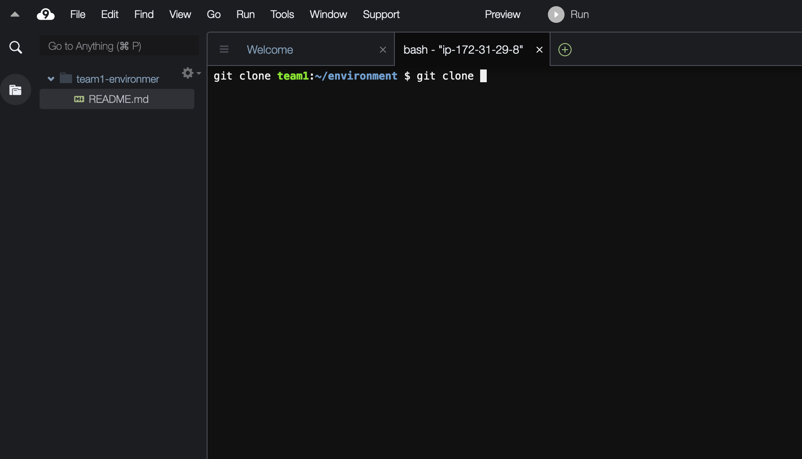

This is the repository URL: https://github.com/slalomdojo/pipeline-templates. After cloning the repo, you will see the repo folder on the left panel:

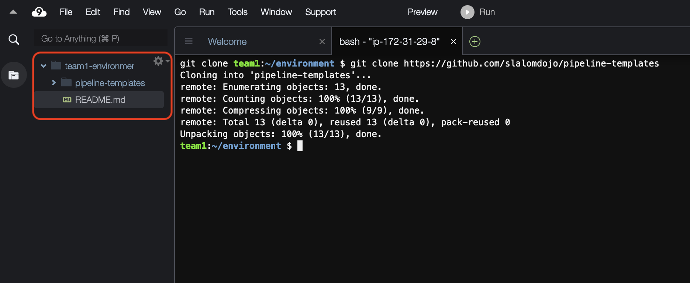

Now you are ready to start building the solution. Good luck!

# Building the Solution

## S3 Bucket for CodePipeline Artifacts (Step 1)

The first step will be to deploy an S3 bucket. This bucket will be used by the pipeline to retrieve the zip file that contains the CloudFormation templates which will be deployed in the last stage by stacker. 

*The rest of the challenge will assume you have opened the templates repository in your IDE.*

Open the file `pipeline/template.yaml`. You should see the following content:

`pipeline/template.yaml`
```yaml
AWSTemplateFormatVersion: '2010-09-09'
Description: Deploys a CodePipeline Pipeline with linting and security-check stages

Parameters:
  Namespace:
    Description: The name of your team (e.g., team1, team2, team3 etc)
    Type: String
  
Metadata:
  AWS::CloudFormation::Interface:
    ParameterGroups:
    - Label:
        default: Resource Naming 
      Parameters:
        - Namespace

Resources:

#================================================================================
# CodePipeline Artifacts S3 Bucket
#================================================================================

  CodePipelineArtifactsS3Bucket:
    Type: AWS::S3::Bucket
    Properties:
      BucketName: BUCKET_NAME
      BucketEncryption:
        ServerSideEncryptionConfiguration:
        - ServerSideEncryptionByDefault:
            SSEAlgorithm: SSE_ALG
      VersioningConfiguration:
          Status: STATUS
      PublicAccessBlockConfiguration:
          BlockPublicAcls: BOOL
          BlockPublicPolicy: BOOL
          IgnorePublicAcls: BOOL
          RestrictPublicBuckets: BOOL

#================================================================================
# CodeBuild Projects
#================================================================================

  CFNLintCodeBuildProject:
    Type: AWS::CodeBuild::Project
    Properties:
        Name: NAME
        Description: DESCRIPTION
        Artifacts:
          Type: ARTIFACT
        Environment:
            Type: TYPE
            ComputeType: COMPUTER_TYPE
            Image: IMAGE
        ServiceRole: IAM_ROLE_ARN
        Source:
            Type: SOURCE_TYPE
            BuildSpec: |
              version: 0.2
              phases:
                install:
                  commands:
                    - COMMANDS

  CFNNagCodeBuildProject:
    Type: AWS::CodeBuild::Project
    Properties:
      ...

  InfraDeployCodeBuildProject:
    Type: AWS::CodeBuild::Project
    Properties:
      ...

#================================================================================
# CodePipeline Deployment Pipeline
#================================================================================

  DeploymentPipeline:
    Type: AWS::CodePipeline::Pipeline
    Properties:
      Name: NAME
      ArtifactStore:
          Location: LOCATION
          Type: TYPE
      RoleArn: IAM_ROLE_ARN
      Stages:
          - Name: NAME
            Actions:
              - Name: NAME
                ActionTypeId:
                  Category: CATEGORY
                  Owner: OWNER
                  Version: VERSION
                  Provider: PROVIDER
                OutputArtifacts:
                  - Name: NAME
                Configuration:
                  S3Bucket: S3_BUCKET
                  S3ObjectKey: S3_OBJECT_KEY
                RunOrder: RUN_ORDER
          - Name: NAME
            Actions:
              - Name: NAME
                ActionTypeId:
                  Category: CATEGORY
                  Owner: OWNER
                  Version: VERSION
                  Provider: PROVIDER
                Configuration:
                  ProjectName: PROJECT_NAME
                InputArtifacts:
                  - Name: NAME
                RunOrder: RUN_ORDER
              - Name: NAME
                ActionTypeId:
                  Category: CATEGORY
                  Owner: OWNER
                  Version: VERSION
                  Provider: PROVIDER
                Configuration:
                  ProjectName: PROJECT_NAME
                InputArtifacts:
                  - Name: NAME
                RunOrder: RUN_ORDER
```

Let's focus on the artifact S3 bucket:

`pipeline/template.yaml`
```yaml
#=====================================
# CodePipeline Artifacts S3 Bucket
#=====================================

  CodePipelineArtifactsS3Bucket:
    Type: AWS::S3::Bucket
    Properties:
      BucketName: BUCKET_NAME
      BucketEncryption:
        ServerSideEncryptionConfiguration:
        - ServerSideEncryptionByDefault:
            SSEAlgorithm: SSE_ALG
      VersioningConfiguration:
          Status: STATUS
      PublicAccessBlockConfiguration:
          BlockPublicAcls: BOOL
          BlockPublicPolicy: BOOL
          IgnorePublicAcls: BOOL
          RestrictPublicBuckets: BOOL
```

Here are the requirements for this bucket:

* Include the following information in the `BucketName`:
  * The name of your team (use the `Namespace` parameter)
  * A few keywords like codepipeline and artifact (so you know what this bucket is being used for)
  * The AWS account ID at the end of the name to make sure your bucket will have a unique name. PS: there's a built-in variable you can use to grab the account ID. You should not hardcode the account ID in your template
  * Here's an example of a name: team100-codepipeline-artifacts-11111111
* Set `BucketEncryption` to use the *AES256* SSE Algorithm
* `Enable Versioning`
* Explicitly `Block` *Public Acls*, *Public Policy*, `Ignore` *Public Acls* and `Restrict` *Public Buckets*.

Before you deploy your stack, remember to comment out the rest of the code otherwise your stack will fail. 

Now you have 2 options for deploying the stack:

1. You can use the Cloud9 terminal and run the AWS CLI
1. Or you can download the template and manually launch the stack using the Cloudformation Console.

Here's the command to create the stack if you'd like to use the terminal:

> **Please pay attention to the following detail: the name of your stack should follow the naming convention teamX-pipeline, where X is the number of your team (e.g. team1-pipeline, team2-pipeline, team3-pipeline). If your stack name is not prefixed by your team's name, you will not be able to launch it.**

```
$ cd $HOME/environment/pipeline-templates/pipeline/
$ aws cloudformation create-stack --stack-name teamX-pipeline --template-body file://template.yaml --parameters ParameterKey=Namespace,ParameterValue=teamX
```

If you prefer to use the [CloudFormation Console](https://console.aws.amazon.com/cloudformation/home?region=us-east-1#/), download the template from your Cloud9 environment, click on **Create stack (with new resources - standard)** in the CloudFormation Console, upload your template and click **Next**. 

For the **Namespace** parameter, enter the name of your team (i.e. team1, team2, team3).

Keep clicking on **Next** until you see the **Create stack** button (**ignore the `Failed to retrieve sns topics`** error - this is expected). Create the stack.

### For Discussion

What would happen if `Versioning` was **not** enabled on this bucket?

### Definition of Done

Two things should happen: your CloudFormation stack should have status **CREATE_COMPLETE** and if you head to the [S3 Console](https://console.aws.amazon.com/s3/home?region=us-east-1), you should see your bucket there.

## Your first Build Stage: Linting (Step 2)

Before we can launch a pipeline, we need to have at least 2 build stages in place. You will not, however, develop all the logic for the build stage at this point. Your Linting build stage should only do one thing for now: say "Hello World!".

Find the code for the Linting build stage in the pipeline template:

`pipeline/template.yaml`
```yaml
#========================
# CodeBuild Projects
#========================

  CFNLintCodeBuildProject:
    Type: AWS::CodeBuild::Project
    Properties:
        Name: NAME
        Description: DESCRIPTION
        Artifacts:
          Type: ARTIFACT
        Environment:
            Type: TYPE
            ComputeType: COMPUTER_TYPE
            Image: IMAGE
        ServiceRole: IAM_ROLE_ARN
        Source:
            Type: SOURCE_TYPE
            BuildSpec: |
              version: 0.2
              phases:
                install:
                  commands:
                    - COMMANDS
```

Use the information below to configure your first build stage:

* The name of the stage should follow the naming convention **teamX-CFNLint** (e.g. team1-CFNLint, team2-CFNLint, team3-CFNLint etc)
* The artifact is being fetched **by the pipeline**, not by this stage
* The environment for this stage will be a **Linux container** running on a **General 1 Small instance**. **Note: please do not deploy a bigger instance as it's not needed. Any team that launches an instance bigger than General 1 Small will have its Build Stage removed**. Use the following image for the container: `aws/codebuild/python:3.6.5`.
* This CodeBuild project should be assigned an IAM Role. **This role has already been created for you so you don't have to worry about it**. To get the Role's ARN, you will need to fetch it from [Parameter Store](https://docs.aws.amazon.com/systems-manager/latest/userguide/systems-manager-parameter-store.html). [Read the documentation to learn how to do it](https://docs.aws.amazon.com/AWSCloudFormation/latest/UserGuide/dynamic-references.html). The name of the parameter should be `/dojo/teamX/iam/role/cfnlint-codebuild-service/arn` where teamX is your team name, and the version should be `1`.
* The source type should be **CODEPIPELINE**. The version of the `BuildSpec` should be **0.2** and it should have a single phase: **install**. For the install phase, there should only be a single command: `echo Hello World!`. If you have never developed a Build Spec before, check the [Build Spec reference](https://docs.aws.amazon.com/codebuild/latest/userguide/build-spec-ref.html).

**Update your stack** once you're done (it goes without saying you should work on a single template and deploy a single stack during this challenge - do not deploy multiple stacks).

### For Discussion

When you assigned a role to the CodeBuild project, if you followed the documentation provided, you used a syntax similar to the following: `{{resolve:ssm:<parameter>:<version>}}`. What other way can you fetch a parameter from Parameter Store without using this syntax?

### Definition of Done

To make sure you've done everything correctly, head over to the [CodeBuild Projects Console](https://console.aws.amazon.com/codesuite/codebuild/projects?region=us-east-1) and check if your project has been created successfully. **You should not run the build stage at this point. You will do that later.**

## The Security Build Stage (Step 3)

After launching the Linting build stage, you will do exactly the same for the Security stage. This is the resource in the template:

`pipeline/template.yaml`
```yaml
  CFNNagCodeBuildProject:
    Type: AWS::CodeBuild::Project
    Properties:
      ...
```

The Linting and Security stages will look very similar. Here are the differences:

* Call this stage **teamX-CFNNag**
* The container image should be `aws/codebuild/ruby:2.5.1`
* The IAM Role ARN parameter name should be `/dojo/teamX/iam/role/cfnnag-codebuild-service/arn` (also version `1`)

The rest should look exactly the same. Update the stack.

### Definition of Done

The definition of done is the same as the Linting stage: you should be able to see the Security stage listed in the CodeBuild Projects console.

## Deploy a CodePipeline Pipeline (Step 4)

Now that we have 2 stages deployed, let's deploy a pipeline using CodePipeline:

`pipeline/template.yaml`
```yaml
#==================================
# CodePipeline Deployment Pipeline
#==================================

  DeploymentPipeline:
    Type: AWS::CodePipeline::Pipeline
    Properties:
      Name: NAME
      ArtifactStore:
          Location: LOCATION
          Type: TYPE
      RoleArn: IAM_ROLE_ARN
      Stages:
          - Name: NAME
            Actions:
              - Name: NAME
                ActionTypeId:
                  Category: CATEGORY
                  Owner: OWNER
                  Version: VERSION
                  Provider: PROVIDER
                OutputArtifacts:
                  - Name: NAME
                Configuration:
                  S3Bucket: S3_BUCKET
                  S3ObjectKey: S3_OBJECT_KEY
                RunOrder: RUN_ORDER
          - Name: NAME
            Actions:
              - Name: NAME
                ActionTypeId:
                  Category: CATEGORY
                  Owner: OWNER
                  Version: VERSION
                  Provider: PROVIDER
                Configuration:
                  ProjectName: PROJECT_NAME
                InputArtifacts:
                  - Name: NAME
                RunOrder: RUN_ORDER
              - Name: NAME
                ActionTypeId:
                  Category: CATEGORY
                  Owner: OWNER
                  Version: VERSION
                  Provider: PROVIDER
                Configuration:
                  ProjectName: PROJECT_NAME
                InputArtifacts:
                  - Name: NAME
                RunOrder: RUN_ORDER
```

Here are the requirements for the pipeline (**for now, we'll iterate on this resource later**):

* The name of the pipeline should follow the standard **teamX-Pipeline** (e.g. team1-Pipeline, team2-Pipeline, team3-Pipeline etc)
* The artifacts should be fetched from the S3 bucket you created in [Step 1](#s3-bucket-for-codepipeline-artifacts-step-1)
* The Role ARN for the pipeline can also be found in Parameter Store. The name of the parameter should be `/dojo/teamX/iam/role/codepipeline-service/arn`, version `1`
* The pipeline should have at this point 2 `Stages`:
  * **Source**
    * The first stage should be called **Source**
    * There should be only one action.
      * Use S3 as the source provider 
      * The name of the action should be **Source**
      * This action should be of type **Source** and the provider should be **S3**
      * It's very important that this stage **outputs an artifact**. Choose whatever name you'd like for the artifact
      * The bucket which will store the artifact should be the same bucket you created in [Step 1](#s3-bucket-for-codepipeline-artifacts-step-1)
      * The S3 bucket key for the artifact should be `deployment.zip` 
        * This means that if your bucket is named **teamx-codepipeline-artifact-11111111** and the s3 bucket key is **deployment.zip**, then the pipeline will find your zip file at the location **s3://teamx-codepipeline-artifact-11111111/deployment.zip**.
  * **Validate-CloudFormation-Templates**
    * The second stage should be called **Validate-CloudFormation-Templates**
    * There should be two actions.
      * The first action should be called **CFN-Lint** and should be of type **Build**
      * The second action should be called **CFN-Nag** and should also be of type **Build**
      * Both actions should be provided with the artifact generated in the **Source stage**
      * **IMPORTANT: These two actions should execute in parallel, not sequentially.**

Update your stack once you're done.

### For Discussion

What is the RunOrder parameter used for when you define a stage action?

### Definition of Done

After the stack is successfully updated and you head to the [CodePipeline Console](https://console.aws.amazon.com/codesuite/codepipeline/pipelines?region=us-east-1), you should see your pipeline deployed. Click on the pipeline. This is what you should then see:

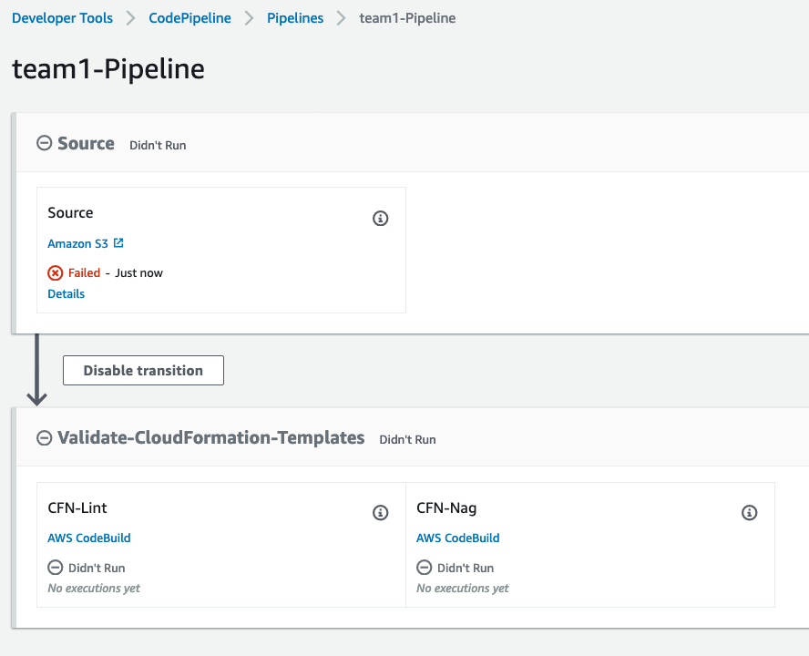

Note that both CFN-Lint and CFN-Nag stages are **beside each other**. If you see the following:

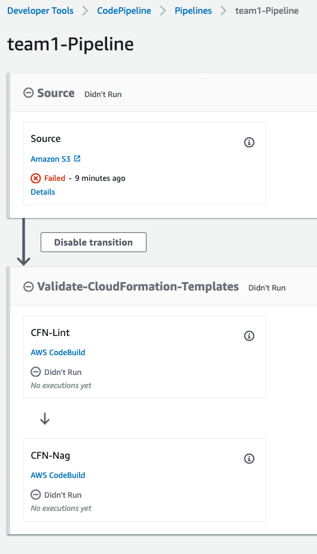

I.e. CFN-Nag underneath CFN-Lint, **it's wrong!** Review the stage actions and **make sure these two stages are executed in parallel.**

At this point, the Source stage of the pipeline should be failing as there's currently no artifact in the S3 bucket. You will work on that next.

## Uploading an artifact to S3 to trigger the pipeline (Step 5)

Now that you have the pipeline in place, let's make sure it's all working. When you cloned the pipeline template repo, you should've seen 4 folders: pipeline, stacker, stacker_blueprints and templates. Take **stacker** and **templates** folders and zip them up (note: it's important that both folders be at the root level of the zip file, so do not zip a folder containing these 2 folders, select the 2 folders in your computer and zip them up). 

You configured your pipeline to monitor a zip file called **deployment.zip**. That means you will have to give this name to your zip file otherwise the pipeline will **not** be triggered.

Go to the S3 Console or use Cloud9's terminal to upload the `deployment.zip` file to your artifact S3 bucket.

### Definition of Done

Go to the CodePipeline Console, look for your pipeline and you should see it being triggered. If that doesn't work, ask for help to one of the organizers.

## CFN-Lint (Step 6)

The first stage of your pipeline will be to run [cfn_lint](https://github.com/aws-cloudformation/cfn-python-lint) against `vpc-sg.yaml`. Before we get to that, let's understand how to structure our build stage.

Right now, this is how your BuildSpec looks like for this build stage:

```yaml
BuildSpec: |
  version: 0.2
  phases:
    install:
      commands:
        - echo Hello World!
```

If you take a look at the [Build Spec documentation](https://docs.aws.amazon.com/codebuild/latest/userguide/build-spec-ref.html), you will see a couple of keywords under **phases**: `install`, `pre_build`, `build` and `post_build`. Honestly, you could run all your build commands in the `install` phase. But to keep our pipeline organized, I'd suggest you break down your commands into each phase accordingly. For example, let's say that you need to compile a Golang application which is on GitHub and later make the binary available using an S3 bucket. This is how you could break down your commands into each phase:

* **install**: install the Golang environment and other tools (if necessary)
* **pre_build**: clone the GitHub repo
* **build**: compile the code
* **post_build**: upload the code to an S3 bucket

This is just a simple example, but hopefully you get the idea.

The following are the commands you should include in your BuildSpec:

1. Upgrade `pip` to the latest version with the command: `pip install --upgrade pip` (pip is already installed by default because you chose the `aws/codebuild/python:3.6.5` image which already comes with a Python environment, but we're just making sure we have the latest version of pip).
1. Install `cfn-lint` using **pip**: `pip install cfn-lint`
1. Run `cfn-lint` against the template: `cfn-lint <path to yaml file>` (you can use a wildcard to lint all yaml files, such as `templates/*.yaml`)

Your BuildSpec should then look like this:

```yaml
BuildSpec: |
  version: 0.2
  phases:
    install:
      commands:
        - [upgrade pip]
        - [install cfn-lint]
        
    build:
      commands:
        - [run cfn-lint]
```

Update your stack. After updating the stack, you will need to upload the `deployment.zip` again to S3 to trigger the pipeline.

### Definition of Done

Once your pipeline finishes executing, you should see the following:

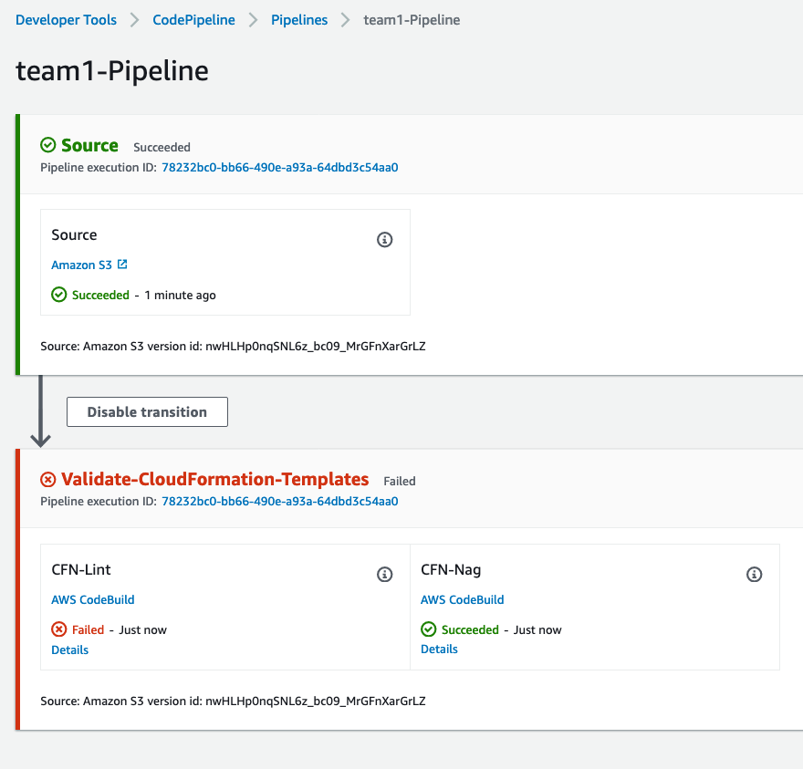

If you click on **Details** at the bottom of the CFN-Lint stage, you will be taken to the CodeBuild logs. Scroll down to the bottom and you will see the following:

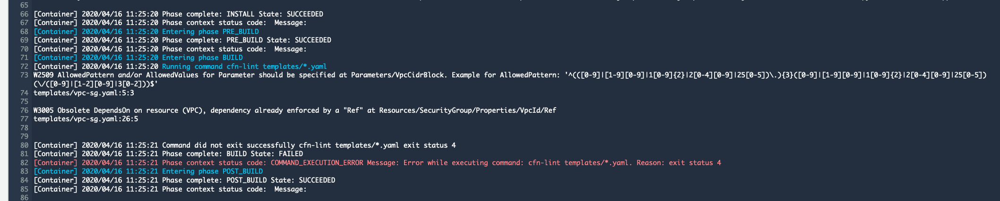

This is totally expected and we'll fix that shortly. Let's move on to the **CFN-Nag** stage.

## CFN-Nag (Step 7)

For the CFN-Nag stage, we'll perform nearly the same steps as we did for CFN-Lint, but there will be a small difference.

CFN-Lint runs in a Python environment. CFN-Nag runs in a Ruby environment. So instead of using pip to install packages, we'll use RubyGems.

Here are the commands you should include in your BuildSpec:

1. Use the `gem` command to install **cfn-nag**: `gem install cfn-nag -v 0.5.35` (this challenge has been written for cfn-nag v0.5.35. If you choose to install another version, things might not work as expected)
1. Use the `cfn_nag_scan` command to run cfn-nag: `cfn_nag_scan -o txt --input-path <path to templates folder>`

When you're done. Update your stack and re-upload `deployment.zip` to S3.

### Definition of Done

Once your pipeline finishes running, the CFN-Nag stage **will succeed**. However, if you click on **Details** and scroll down, you will see a lot of warnings:

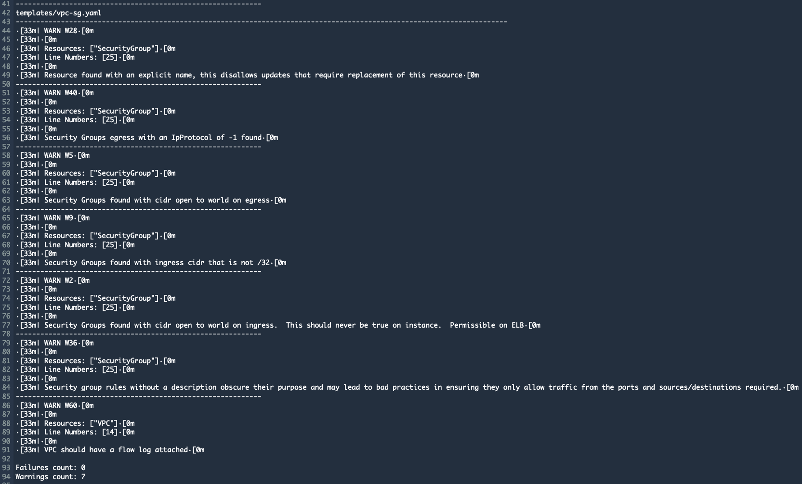

This is just to show you that CFN-Nag is working as expected.

## Fixing the issues found by CFN-Lint (Step 8)

Let's quickly fix the issues found by the linter. Open `templates/vpc-sg.yaml` and add/remove the following lines:

`templates/vpc-sg.yaml`
```yaml
AWSTemplateFormatVersion: "2010-09-09"
Description: Creates a VPC and a Security Group for a web server

Parameters:
  VpcCidrBlock:
    Description: The CIDR Block for the VPC
    Type: String
    AllowedPattern: '^(([0-9]|[1-9][0-9]|1[0-9]{2}|2[0-4][0-9]|25[0-5])\.){3}([0-9]|[1-9][0-9]|1[0-9]{2}|2[0-4][0-9]|25[0-5])(\/([0-9]|[1-2][0-9]|3[0-2]))$' # <- Add (#1)
  Namespace: 
    Description: The name of your team (e.g., team1, team2, team3 etc) account name in lower case (used in resource naming).
    Type: String

Resources:
  VPC:
    Type: AWS::EC2::VPC
    Properties: 
      CidrBlock: !Ref VpcCidrBlock
      EnableDnsHostnames: true
      EnableDnsSupport: true
      InstanceTenancy: default
      Tags: 
        - Key: namespace
          Value: !Ref Namespace
  
  SecurityGroup:
    Type: AWS::EC2::SecurityGroup
  DependsOn: VPC # <- Remove (#2)
    Properties: 
      GroupDescription: Security Group for a web server
      GroupName: !Sub ${Namespace}-web-server
      SecurityGroupEgress: 
        - CidrIp: 0.0.0.0/0
          IpProtocol: "-1"
      SecurityGroupIngress: 
        - IpProtocol: tcp
          FromPort: 80
          ToPort: 80
          CidrIp: 0.0.0.0/0
      Tags: 
        - Key: namespace
          Value: !Ref Namespace
      VpcId: !Ref VPC

Outputs:
  VpcId:
    Value: !Ref VPC 
  SgId:
    Value: !Ref SecurityGroup
```

Here's a brief explanation of why we're doing the above:

1. The linter complained that we are asking for a CIDR block but we're not verifying the parameter will actually be a CIDR Block. So to fix that, you should add `AllowedPattern` to the parameter `VpcCidrBlock`
1. Because at the bottom of the `SecurityGroup` resource we're referencing the VPC (`!Ref VPC`), we do not need to tell CloudFormation that **SecurityGroup** `DependsOn` **VPC** - that's what `!Ref` is already doing.

You do not need to update the stack this time. Just re-upload **deployment.zip** with the new `vpc-sg.yaml`. 

*If you'd like to know what rules CFN-Lint checks templates against, [check this list](https://github.com/aws-cloudformation/cfn-python-lint/blob/master/docs/rules.md).*

### Definition of Done

You should see all green in your pipeline now.

## Creating your own CFN-Nag rule (Step 9)

Suppose that for compliance reasons, your company cannot deploy EC2 instances on a VPC where the tenancy is set to `default`, i.e. you can only deploy instances on dedicated hardware. To mitigate that, you will write a CFN-Nag rule that will check templates for VPCs that has `InstanceTenancy` set to `default`. If that's the case, then that template **should not pass** the CFN-Nag build stage in the pipeline.

To write a CFN-Nag rule, you will have to use **Ruby**. But don't worry, you do not need to be a Ruby expert. 

### Folder structure

In the pipeline repo root folder, create the following folder structure:

```
custom-rules/
|-- bin/
`-- lib/
```

### Gemfile

At the root of the `custom-rules` folder, create a file called **Gemfile**. This should be the content of the Gemfile:

`Gemfile`
```ruby
# frozen_string_literal: true

source 'https://rubygems.org'

gemspec
```

**PS: every time you see the line `frozen_string_literal: true` keep it at the top and do not remove it. If you are curious to know why, read this [blog post](https://www.lucascaton.com.br/2016/01/19/what-is-frozen_string_literal-in-ruby/).**

### Gemspec

Next, create a file called `cfn-nag-tenancy-checker.gemspec`, also at the root of the `custom-rules` folder. Here's how this file should look like:

`cfn-nag-tenancy-checker.gemspec`
```ruby
# frozen_string_literal: true

Gem::Specification.new do |s|
  s.name          = 'cfn-nag-tenancy-checker'
  s.license       = 'MIT'
  s.version       = '<VERSION>'
  s.bindir        = 'bin'
  s.executables   = %w[cfn_nag_custom]
  s.authors       = ['<YOUR_NAME>']
  s.summary       = 'Tenancy Checker'
  s.description   = 'Wrapper to execute custom rules with cfn_nag'
  s.homepage      = 'https://github.com/stelligent/cfn_nag'
  s.files         = Dir.glob('lib/**/*.rb')

  s.require_paths << 'lib' 
  s.required_ruby_version = '>= 2.2'

  s.add_development_dependency('rspec', '~> 3.4')
  s.add_development_dependency('rubocop')

  s.add_runtime_dependency('cfn-nag', '>= 0.3.73')
end
```

Replace `<VERSION>` and `<YOUR_NAME>` with the correct information (you can choose any version you'd like - e.g. 1.0.0).

### cfn_nag_custom

Now you'll create a wrapper script to help us execute the custom rule against your template. Create a file called `cfn_nag_custom` under `bin` (you do not need to change anything):

`bin/cfn_nag_custom`
```bash
#!/usr/bin/env ruby

args = *ARGV
path = Gem.loaded_specs['cfn-nag-tenancy-checker'].full_gem_path
command = "cfn_nag -r #{path}/lib/rules #{args.join(" ")}"
system(command)
```

### Tenancy Checker Rule

It's finally time to build your rule. Create a file called `TenancyCheckerRule.rb` under `lib/rules/`. You will not be provided with the final code, but take a look at the code below:

```ruby
# frozen_string_literal: true

require 'cfn-nag/custom_rules/base'

class ExampleCustomRule < BaseRule
  def rule_text
    'S3 buckets should always be named "foo"'
  end

  def rule_type
    Violation::FAILING_VIOLATION
  end

  def rule_id
    'C1'
  end

  def audit_impl(cfn_model)
    resources = cfn_model.resources_by_type('AWS::S3::Bucket')

    violating_buckets = resources.select do |bucket|
      bucket.bucketName != 'foo'
    end

    violating_buckets.map(&:logical_resource_id)
  end
end
```

The code above checks whether S3 buckets have been named `foo`, otherwise rejects the template (not a useful rule, but it's just to give you an idea of the code). Use the template above to build your own. Here are the requirements for your rule:

* Your rule should result in **Failing Violation** if any VPC in a CloudFormation template hasn't got `InstanceTenancy` set to `dedicated`
* The name of the class **MUST BE** `TenancyCheckerRule` - It seems that if the name of the class is not the same as the name of the file, things can get messy with the current version of cfn_nag (as of this writing)

### Definition of Done

This should be the final folder structure (with files created):

```
custom-rules/
├── Gemfile
├── bin
│   └── cfn_nag_custom
├── cfn-nag-tenancy-checker.gemspec
└── lib
    └── rules
        └── TenancyCheckerRule.rb

3 directories, 4 files
```

## Adding custom rules to the pipeline (Step 10)

To add your custom rule to the pipeline, you will have to add/change commands in the CFN-Nag BuildSpec ([Step 7](#cfn-nag-step-7)):

1. Enter the `custom-rules` folder
1. Run the command `gem build cfn-nag-tenancy-checker.gemspec`
1. The command above will generate a `.gem` file. Install that gem with `gem install`
1. Finally, run `cfn_nag_custom` (instead of `cfn_nag_scan`) against all YAML files in the templates directory

### Definition of Done

At the time of this writing, it seemed that `cfn_nag` was not returning an exit code different than `0` when it found a failing violation. Therefore, it's possible that in your pipeline the build stage will succeed even though a failing violation was found. Regardless whether the build stage passed or not, click on **Details** and make sure you see your rule failing (if you did not change `rule_id`, your rule should be labelled `C1`).

## Deploying CloudFormation Templates with Stacker (Step 11)

Stacker is a powerful tool that allows you to manage multi-account, multi-region CloudFormation stacks deployment easily. To use stacker, you will need mainly two files:

* `stacker-config.yaml` - Configuration file that lists all the stacks to be deployed, as well as other information such as where to find the template for the stack, parameters etc.
* `stacker_profiles` - An AWS Credentials file where you will list all IAM Roles of all accounts that Stacker should deploy CloudFormation stacks to.

### stacker-config.yaml

In the pipeline repo, there is a folder called `stacker`. In that folder, you will find a file called `stacker-config.yaml` that looks like the following:

`stacker-config.yaml`
```yaml
#--------------------------------------------------------#
# Global variables
#--------------------------------------------------------#
namespace: teamX
stacker_execution_profile: &stacker_execution_profile stacker_execution
stacker_bucket: "" 
vpc_cidr_block: &vpc_cidr_block 10.0.0.0/16

#--------------------------------------------------------#
# Stack Definitions 
# (https://stacker.readthedocs.io/en/latest/config.html)
#--------------------------------------------------------#
stacks:
  - name: vpc-sg
    profile: *stacker_execution_profile
    template_path: templates/vpc-sg.yaml
    variables:
      VpcCidrBlock: *vpc_cidr_block
      Namespace: teamX
```

The file is pretty self-explanatory. At the top there are a couple of variables defined: 

* `namespace` is a required variable so do not remove it - stacker will prefix the name of your stack with the value of that variable. 
* `stacker_bucket` is set to empty so stacker doesn't create an S3 bucket for the CloudFormation templates - also, don't remove this variable. 
* `stacker_execution_profile` - we'll talk about this variable in the next section
* `vpc_cidr_block` is the address of the VPC you will be deploying. Note that we're using [YAML Anchors](https://confluence.atlassian.com/bitbucket/yaml-anchors-960154027.html) for this variable.

Then at the bottom, there is a `stacks` array in which each item is a CloudFormation stack to be deployed. For each item, you should provide the name of the stack, the profile, the path to the template and input parameters.

### stacker_profiles

When you launch stacker, you need to provide a file which is identical to an AWS Credentials file - with the exception that you will not provide any access keys or secret access keys. This file is not included in the pipeline repository you cloned at the beginning of the event, so don't be alarmed if you won't see it there. This is how this file should look like:

`stacker_profiles`
```yaml
[profile stacker_master]
role_arn = arn:aws:iam::<BUILD_AWS_ACCOUNT>:role/team1-StackerMasterRole
credential_source = EcsContainer
role_session_name = stacker_master_role_session

[profile stacker_execution]
role_arn = arn:aws:iam::<TARGET_AWS_ACCOUNT>:role/StackerExecutionRole
source_profile = stacker_master
```

This is how stacker uses this file to deploy CloudFormation stacks:

1. When executing the `stacker` command, you need to provide the name of the profile which is associated with an IAM Role in the same account where the pipeline lives (build account in this case)
2. For each stack defined in `stacker-config.yaml`, stacker will take a look at the `profile` variable. Remember?

`stacker-config.yaml`
```yaml
stacks:
  - name: vpc-sg
    profile: *stacker_execution_profile <--------- This variable
    template_path: templates/vpc-sg.yaml
    variables:
      VpcCidrBlock: *vpc_cidr_block
      Namespace: team1
```

3. The `profile` variable will tell stacker which profile's IAM Role it should assume. In our case, `stacker_execution_profile` is set to `stacker_execution`, which is the second profile defined in `stacker_profiles`
4. stacker will then assume the IAM Role with ARN `arn:aws:iam::<TARGET_AWS_ACCOUNT>:role/StackerExecutionRole` and create the CloudFormation stack using this role.

PS: you do not need to create `stacker_profiles` at this point. Keep reading.

### Creating a CodeBuild Project for deploying CloudFormation stacks

Now that you have a basic understanding of `stacker-config.yaml` and `stacker_profiles`, it's time to create the **final** build stage of your pipeline. This is the resource in the pipeline template we're talking about:

`pipeline/template.yaml`
```yaml
InfraDeployCodeBuildProject:
  Type: AWS::CodeBuild::Project
  Properties:
    ...
```

Here are the requirements for the final stage (very similar to the lint stage):

* Name of the stage should be **teamX-InfraDeploy**
* Artifact should be of type **CODE_PIPELINE**
* The environment for this stage will also be a **Linux container** running on a **General 1 Small instance**. Use the image: `aws/codebuild/python:3.6.5`
* You might need some environment variables, but I will let you figure that one out! :) 
* You can find the IAM Role ARN for this stage by resolving the following Parameter Store parameter: `/dojo/teamX/iam/role/deployment-codebuild-service/arn` (version `1`)
* Source Type should be **CODEPIPELINE**. The version of the `BuildSpec` should be **0.2** and it should have a two phases: **install** and **build**. We will discuss each phase in details now.

For this **install** phase:

* Install stacker using the command: `pip install stacker==1.7.0`

For the **build** phase:

* Remember `stacker_profiles`? So, you will have to create that file during runtime. Here is the info you will need: 
  * Build account number: **227756917118**
  * Target account number: **056568479691**
  * The IAM Role names `team1-StackerMasterRole` and `StackerExecutionRole` should not be changed
* Export an environment variable called `AWS_CONFIG_FILE` and set it to the path of the file (`stacker_profiles`) you created in the previous command
* Finally, run the following command to deploy the stacks: `stacker build "<PATH_TO_stacker-config.yaml>" --profile <NAME_OF_AWS_PROFILE_FOR_BUILD_ACCOUNT> --recreate-failed`

### Definition of Done

Go to the CodePipeline Console and select your pipeline. A good indication that your final stage was successful is to see it green in the pipeline. However, to be 100% certain, you will have to jump to the target account and check the CloudFormation console. If you have never switched roles before, [follow the AWS documentation](https://docs.aws.amazon.com/IAM/latest/UserGuide/id_roles_use_switch-role-console.html). This is the information you will need:

* AWS account number: **056568479691**
* Role name: **TeamAssumeRole**

Once you've switched roles, check 2 things:

* There is a CloudFormation stack with the same name as the one you provided in `stacker-config.yaml` (prefixed by the namespace - your team name)
* There is a VPC with address 10.0.0.0/16 named `teamX`

## BONUS: Generating CloudFormation Templates Dynamically using Stacker Blueprints (Step 12)

Before we start this step, I have to say, you are a warrior! Congrats for making it this far and I appreciate your dedication to solving this challenge!

You will now explore a very cool functionality of stacker: [Blueprints](https://stacker.readthedocs.io/en/latest/blueprints.html). From stacker's website:

> Blueprints are python classes that dynamically build CloudFormation templates. Traditionally, blueprints are built using troposphere, but that is not absolutely necessary. You are encouraged to check out the library of publicly shared Blueprints in the stacker_blueprints package.

Why do we need to generate our own CloudFormation template?

### Dynamically calculating subnet addresses

Imagine that you receive the following requirement from your boss/client/customer:

> I need the pipeline to be able to deploy a VPC with a certain number of subnets. I do not want to have to calculate the subnet addresses so I should be able to provide the pipeline with the VPC address and the maximum amount of hosts per subnet and it should dynamically figure out how many subnets are needed and the address of each one.

For example, if your boss/client/customer provides your pipeline with the following information:

* VPC Address: `10.0.0.0/16`
* Maximum number of hosts per subnet: `8190`

Your pipeline should calculate that the VPC will need **8 subnets** with addresses:

* 10.0.0.0/19
* 10.0.32.0/19
* 10.0.64.0/19
* 10.0.96.0/19
* 10.0.128.0/19	
* 10.0.160.0/19
* 10.0.192.0/19
* 10.0.224.0/19

Take a look at the calculation below (I strongly advise you to play around with this [Visual Subnet Calculator](http://www.davidc.net/sites/default/subnets/subnets.html) to solve this problem):

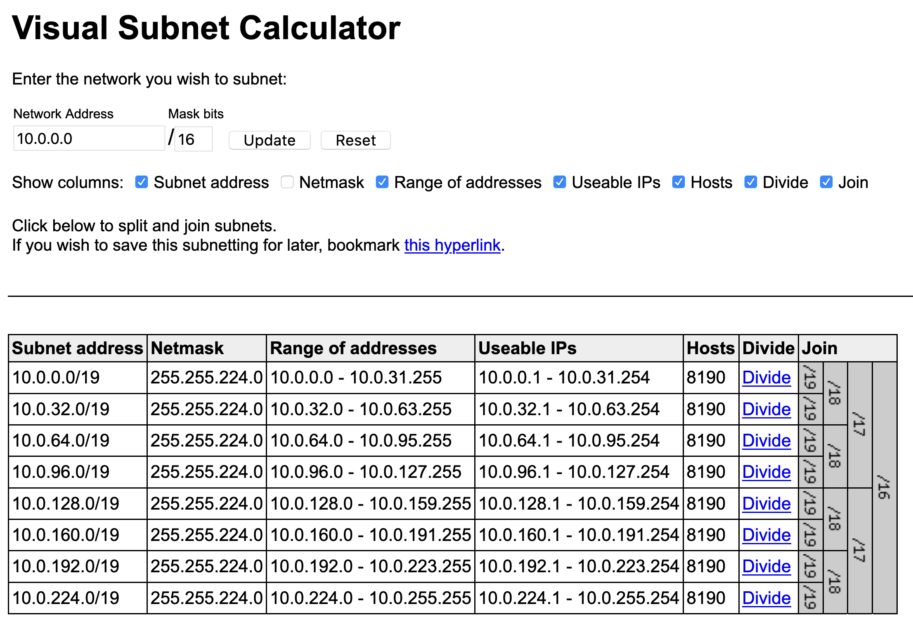

As you can see, by breaking down a `/16` address all the way down to `/19`, that will give you the number of hosts required. 

Now, naturally, you cannot do such a complex calculation just using pure CloudFormation. You really need a programming language to make all these calculations and then generate the final template. That's why you will use stacker Blueprints.

### Creating your first Blueprint

In a few words, stacker Blueprints is a feature that allows you to write a Python script to generate CloudFormation templates for stacker. Will you generate a YAML/JSON file yourself using a yaml/json Python library? No. You will use a very popular Python library called [Troposphere](https://github.com/cloudtools/troposphere) to do that. Let's do this step by step.

First, go to the pipeline template repository folder in your local computer and you will notice there is one folder there we haven't talked about yet: `stacker_blueprints`. 

```
stacker_blueprints/
├── custom_blueprints
│   ├── __init__.py
│   └── vpc.py
└── setup.py

1 directory, 3 files
```

Because you will develop your own Blueprint, you need to somehow make this Blueprint available to stacker. What you will do is to turn your Python script (i.e. Blueprint) into a Python package. That's why you see these two files: `setup.py` and `__init__.py`. The `vpc.py` file is where you will develop the code to generate the final template. Open `vpc.py`.

The portion of code we're mostly interested in is the VPC class:

```python
class VPC(Blueprint):
    # These variables are the ones that you will have to specify in stacker-config.yaml when you call
    # this class
    VARIABLES = {
        "Namespace": {
            "type": str,
            "description": "The name of your team (team1, team2, team3)."
        },
        "VpcCidrBlock": {
            "type": str,
            "description": "The CIDR Block for the VPC."
        },
        "HostsPerSubnet": {
            "type": int,
            "description": "The maximum number of hosts for each subnet."
        }
    }

    def create_vpc(self):
        t = self.template
        t.add_resource(
          ec2.VPC(
            VPC_NAME,
            CidrBlock=self.get_variables()["VpcCidrBlock"], 
            EnableDnsSupport=True,
            EnableDnsHostnames=True,
            Tags=Tags(Name=self.get_variables()["Namespace"])
          )
        )

        t.add_output(Output("VpcId", Value=VPC_ID))

    def create_subnets(self):
        t = self.template

        vpc_cidr = self.get_variables()["VpcCidrBlock"]
        n_hosts = self.get_variables()["HostsPerSubnet"]
        
        # Calculate the number of subnets and their addresses here

        # For each calculated subnet
          t.add_resource(
              ec2.Subnet(
                  RESOURCE_NAME, # If there will be more than one subnet, this resource name needs to be unique
                  AvailabilityZone=AZS[?], # How can you distribute the subnets across as many AZs as possible?
                  VpcId=VPC_ID,
                  CidrBlock=SUBNET_CIDR_BLOCK, # This will come from the calculation above
                  Tags=Tags(Name="%s - %s" % (self.get_variables()["Namespace"], SUBNET_CIDR_BLOCK)) # This will generate the following tag: Name: teamX - x.x.x.x/x
              )
          )

    # This is a function that returns the final CloudFormation template to stacker. There is no need to explicitly "return" anything.
    def create_template(self):
        self.create_vpc()
        self.create_subnets()
```

Here's a summary of everything you're seeing in this file:

* The **class VPC** represents the **entire** CloudFormation template and **not** just a VPC resource. Within this template, you can define any resources you want, but obviously it would make sense to only have resources related to VPC.
* **VARIABLES** at the top, as the comment explains, are the variables that will be passed to this class through **stacker-config.yaml**:

`stacker/stacker-config.yaml`
```yaml
stacks:
  - name: vpc
    profile: *stacker_execution_profile
    class_path: <class_path>
    variables: <- Here
      VpcCidrBlock: <VpcCidrBlock>
      Namespace: <Namespace>
      HostsPerSubnet: <HostsPerSubnet>
```

Back to `vpc.py`:

* The method `create_template` is the method that will be called by stacker to get the final CloudFormation template
* The methods `create_vpc` and `create_subnets` are helper methods so we don't do everything in `create_template`
* Because the class VPC is of type `Blueprint`, you inherit a couple of attributes and methods (`create_template` is one of those methods)
* To add resources to the final template, you must get a reference to `self.template` and then call `add_resource` on that object. This `add_resource` method is [defined in a class called Template in Troposphere's __init__.py](https://github.com/cloudtools/troposphere/blob/master/troposphere/__init__.py)
* To add outputs to the template, use the method `add_output`, also defined in the [Template class](https://github.com/cloudtools/troposphere/blob/master/troposphere/__init__.py)

Now to the fun part! In the method `create_subnets`, after obtaining the VPC CIDR block and the maximum number of hosts, you will have to develop some code to calculate how many subnets there will be in the final template, as well as their addresses. Use the libraries `math` and `ipaddress` for that.

> TIP: use the python interpreter in your terminal to develop this code - it will save you some time. 

Good luck and come back here when you're done.

### Making modifications to stacker-config.yaml

Go back to `stacker-config.yaml`. You will have to make a couple of changes:

1. In `templates/vpc-sg.yaml`, remove the VPC resource (since it will be defined in its own template) and create a **Parameter** to get a VPC ID (you will need an VPC ID for the Security Group). Rename `templates/vpc-sg.yaml` to `templates/sg.yaml`
2. In `stacker-config.yaml`, create two stacks as shown below:

```yaml
stacks:
  - name: vpc
    profile: *stacker_execution_profile
    class_path: custom_blueprints.vpc.VPC
    variables:
      Namespace: teamX
      VpcCidrBlock: 10.0.0.0/16
      HostsPerSubnet: 4094
  - name: sg
    profile: *stacker_execution_profile
    template_path: templates/sg.yaml
    variables:
      VpcId: <?>
      Namespace: teamX
```

3. Note that the VPC address should be `10.0.0.0/16` and the maximum number of hosts per subnet should be `4094`
4. How can you grab the VPC ID from the `vpc` stack and use it in the `sg` stack? [See stacker Lookups](https://stacker.readthedocs.io/en/latest/lookups.html)

Just one more thing.

### Installing the custom_blueprints package

When you declared the `vpc` stack, you used a key called `class_path` with the value `custom_blueprints.vpc.VPC`. Basically, this value can be broken down as:

* `custom_blueprints` - This is the package
* `vpc` - This is the module in the `custom_blueprints` package
* `VPC`- This is the class declared in the `vpc` module

But how do you make your `custom_blueprints` package available to stacker? Using the command `pip install -e .` (`-e` is for development mode).

Go back to your pipeline CloudFormation template. In the deploy build stage, you will need to add the command `pip install -e .` in the `install` phase. This command should be run **inside** the `stacker_blueprints` folder. That should make the package `custom_blueprints` available in the stage's Python environment and you should be good to go!

### Definition of Done

After uploading a new zip file to S3 and watching your pipeline succeed, you should see two stacks on CloudFormation Console:

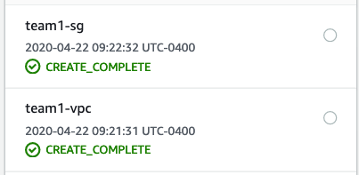

Now, in the VPC Console, go to Subnets and filter by your team name. With a VPC address of `10.0.0.0/16` and a maximum number of hosts of 4094, your pipeline should've deployed **16 subnets** as shown below:

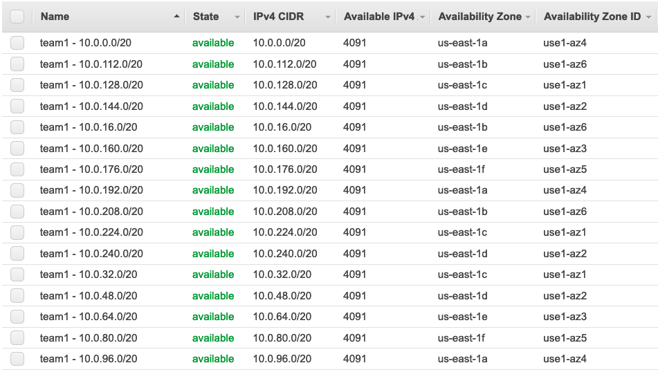

You can see the number of **Available IPv4** is 4091 because AWS reserves 3 IPs for internal use (plus the subnet and broadcast addresses which are also reserved). Here's how it looks in the Visual Subnet Calculator:

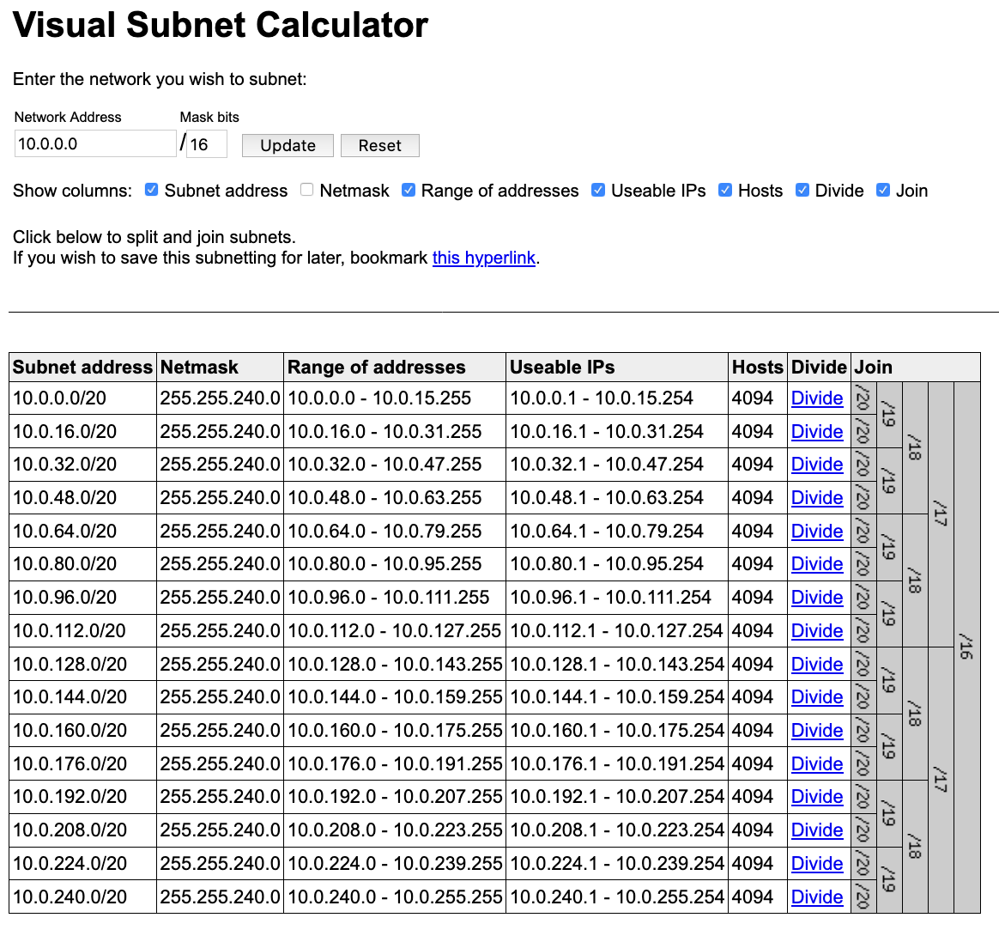

# Conclusion

Congratulations on finishing the challenge! Here's a recap of what you learned:

* Set up a multi-stage pipeline using AWS' CodePipeline
* Validate CloudFormation templates against the CloudFormation specification
* Identify patterns in CloudFormation templates that indicate insecure infrastructure
* Use a powerful programming language such as Ruby to develop your own security standards for the pipeline
* Use yet another powerful programming language such as Python to intelligently generate CloudFormation templates
* Dynamically calculate subnet addresses of a VPC based on parameters passed to the pipeline
* Deploy CloudFormation stacks to multiple AWS accounts using stacker

I hope you had fun doing this challenge. See you in the next DevOps Dojo!